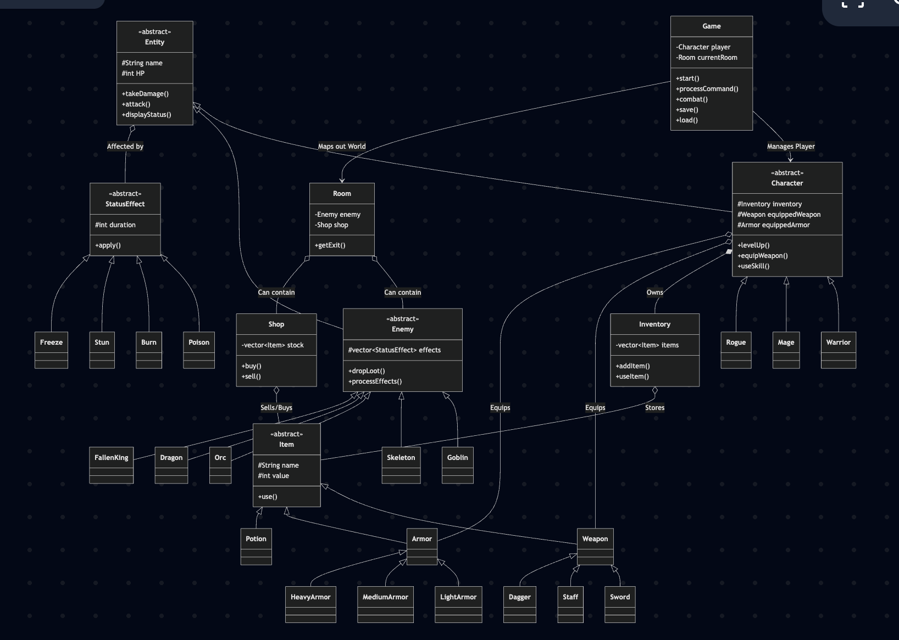

# 👑 Ashen Crown

**Ashen Crown** е конзолна (текстова) ролева игра (RPG), разработена изцяло на обектно-ориентиран C++. Играчът влиза в ролята на приключенец, който изследва мрачен фентъзи свят, сражава се с чудовища, събира екипировка и се изправя срещу тираничния *Fallen King*.

---

## ✨ Функционалности

*   **Създаване на герой** — играчът въвежда име и избира клас (Warrior/Mage/Rogue), всеки с различни начални stats (HP, ATK, DEF, MP)
*   **Карта и движение** — свързани стаи с посоки (N/S/E/W), всяка стая има описание и може да съдържа враг, магазин или NPC
*   **Бойна система** — ход по ход, играчът избира действие (атака/умение/предмет/бягство), всеки враг се държи различно
*   **Инвентар** — преглед на предмети, екипиране на оръжие/броня, ползване на зелие, изхвърляне на предмет
*   **Магазин** — в определени стаи играчът може да купува и продава предмети срещу злато
*   **Система за умения по ниво** — всеки клас отключва различни умения при достигане на определено ниво (Warrior: Whirlwind на ниво 3, Mage: Fireball на ниво 1, Thunderstorm на ниво 5 и т.н.)
*   **Левъл-ъп система** — натрупване на XP след бой, автоматично качване на ниво и подобряване на stats
*   **Различни типове врагове** — Goblin (атакува два пъти), Skeleton (без слабост към отрова), Dragon (boss с FireBreath на всеки 3 хода)
*   **Сейв/Лоуд** — запис на текущото състояние (герой, инвентар, стая, ниво) във файл и зареждане при следващо стартиране
*   **Status effects** — отрова, горене и зашеметяване се прилагат по време на бой и имат ефект всеки ход

---

## 🏗️ Архитектура (Class Dependencies)

Диаграмата по-долу показва основните зависимости и наследявания между класовете в проекта.

# 1. Компилиране на проекта
make

# 2. Стартиране на играта
./AshenCrown